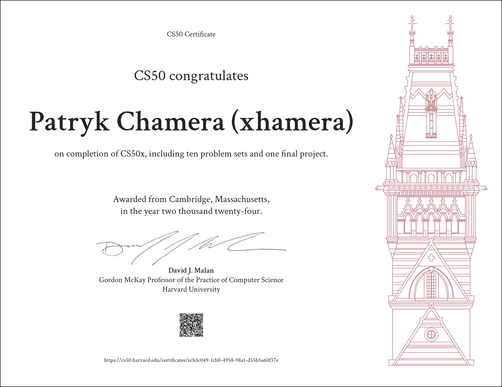

# My CS50x Journey

## Overview
I successfully completed Harvard's **CS50x Introduction to Computer Science**, a comprehensive course designed to introduce fundamental concepts in computer science and programming. Throughout the course, I explored various topics, completed weekly problem sets, and culminated my learning with a final project.

## Topics Covered:
0. **Scratch** – Introduction to programming through a block-based visual language.
1. **C** – Procedural programming, including concepts of variables, functions, and loops.
2. **Arrays** – Understanding and implementing data storage using arrays.
3. **Algorithms** – Analyzing and implementing algorithms for efficient problem solving.
4. **Memory** – Concepts of memory management and pointers.
5. **Data Structures** – Implementing and using data structures like linked lists, hash tables, and stacks.
6. **Python** – High-level programming and solving real-world problems using Python.
6.5. **Artificial Intelligence (AI)** – Basics of AI and machine learning.
7. **SQL** – Working with databases and SQL queries.
8. **HTML, CSS, and JavaScript** – Introduction to web development and building dynamic web pages.
9. **Flask** – A microframework for Python used for building web applications.
10. **Cybersecurity** – Concepts of security and encryption.

## Weekly Assignments
For each topic, I completed a series of problem sets and projects, designed to challenge and solidify my understanding of the material.

## Final Project
The final project allowed me to apply everything I had learned throughout the course. I developed an application that demonstrated my ability to solve real-world problems using the skills acquired in CS50x.
